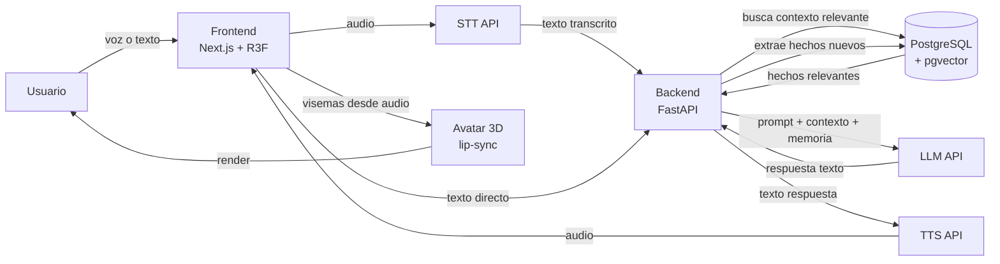
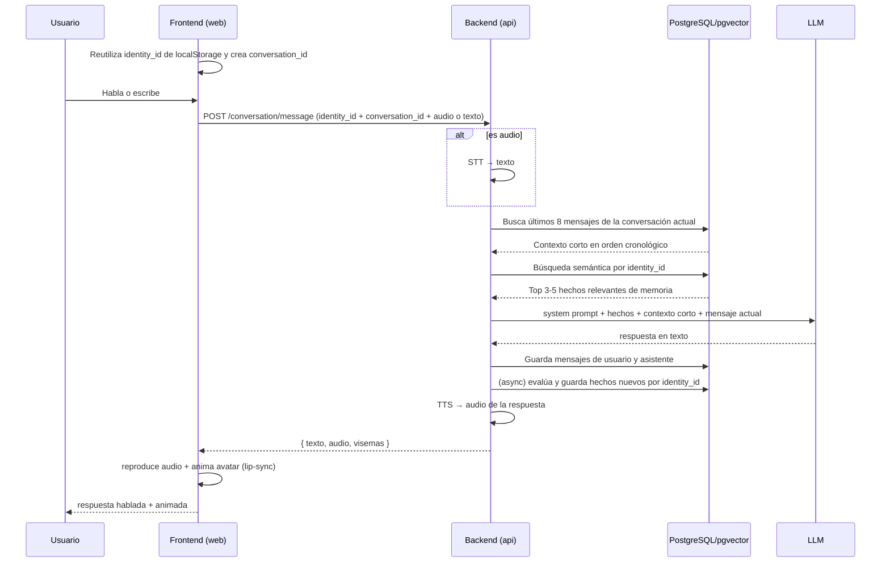
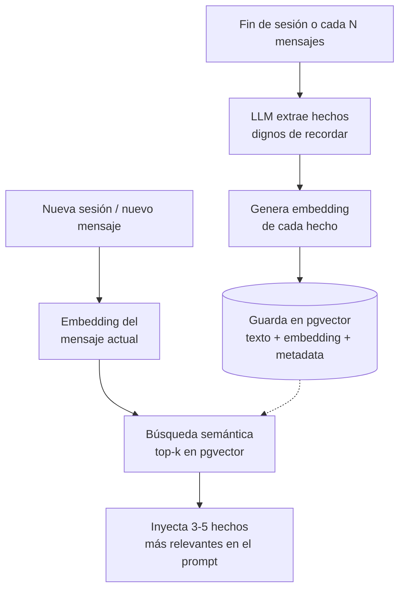

# Arquitectura del sistema

> Este documento explica cómo encajan las piezas del pipeline. Para el qué y el por qué del proyecto, ver `PROJECT.md` en la raíz. Para el historial de decisiones y trade-offs, ver `DECISIONS.md`.

## 1. Visión general del pipeline



**Regla de oro del diseño:** el backend (`api`) es la única pieza que habla con el LLM, la base de datos y los proveedores de STT/TTS. El frontend nunca llama directamente a esos servicios — evita exponer API keys en el cliente y mantiene toda la lógica de memoria/personalidad en un solo lugar.

## 2. Flujo de una interacción (secuencia)



Nota: los dos mensajes del intercambio se guardan antes de responder para que el siguiente request disponga del contexto corto completo. La extracción de hechos de memoria larga (`A->>D` async) no bloquea la respuesta.

## 3. Componentes y responsabilidades

### `apps/web` (Next.js + React Three Fiber)
- Captura de audio/texto del usuario
- Generación y persistencia local de `identity_id`; creación de un `conversation_id` por carga
- Reproducción de audio de respuesta
- Render del avatar 3D y animación de lip-sync a partir de los visemas recibidos (o calculados en el navegador vía Web Audio API, según lo decidido en `DECISIONS.md`)
- **No contiene lógica de negocio** (ni personalidad, ni memoria, ni llamadas directas a LLM/STT/TTS)

### `apps/api` (FastAPI)
- Endpoint principal de conversación (orquesta STT → memoria → LLM → TTS)
- Módulo de memoria: extracción de hechos, generación de embeddings, búsqueda semántica
- System prompt del personaje (personalidad, tono, límites — ver `PROJECT.md` sección 6)
- Guardrails de seguridad (detección de señales de angustia, sin tácticas de despedida manipulativas — `PROJECT.md` sección 7)

### PostgreSQL + pgvector
- Tabla de mensajes recientes delimitados por identidad y conversación
- Tabla de "hechos de memoria" asociados a la identidad, con: texto del hecho, embedding, fecha, tema, importancia estimada
- Un solo motor de datos — evita mantener una base relacional y una vector DB por separado

## 4. Diseño de la memoria (detalle)

### 4.1 Memoria de largo plazo



Puntos clave a respetar:
- **Nunca** usar el historial crudo completo como memoria de largo plazo — solo hechos resumidos y relevantes al contexto actual.
- La extracción de hechos es un paso propio con el LLM (prompt separado del de conversación), no se mezcla con la respuesta al usuario.
- Cada hecho guarda metadata de importancia/fecha para poder priorizar o hacer "olvido" de hechos poco relevantes con el tiempo (no implementado en el MVP, pero el esquema debe soportarlo desde el inicio).
- Los hechos se guardan y recuperan por `identity_id`, que persiste en el navegador entre conversaciones.

### 4.2 Contexto conversacional de corto plazo

Los mensajes crudos cumplen una función acotada y distinta de la memoria anterior. Cada carga crea un `conversation_id`; antes de llamar al LLM, el backend recupera para esa conversación los últimos ocho mensajes anteriores (cuatro intercambios), los ordena cronológicamente y construye el prompt así:

1. `system prompt` y hechos semánticos relevantes de la identidad.
2. Hasta ocho mensajes recientes con sus roles `user`/`assistant`.
3. Mensaje actual del usuario.

Después de obtener la respuesta, el backend guarda el mensaje actual y la respuesta como un nuevo intercambio. El límite fijo evita crecimiento ilimitado y una conversación nueva no recibe mensajes crudos de la anterior; la continuidad entre conversaciones depende exclusivamente de los hechos extraídos. Ver ADR-013.

## 5. Contratos de API (sketch inicial)

```
POST /conversation/message
  body: { identity_id, conversation_id, text?, audio_base64? }
  response: { text, transcript, audio_base64, audio_error, timings, visemes[] }

GET /memory/facts?identity_id=...
  response: { facts: [{ text, created_at, topic }] }

DELETE /memory/facts?identity_id=...
  → borra todos los hechos de memoria de la identidad (requisito ético, PROJECT.md sección 7)
```

Estos contratos son punto de partida — ajustar y documentar cualquier cambio en `DECISIONS.md`.

## 6. Limitaciones conocidas del MVP (documentar, no ocultar)

- La búsqueda semántica de memoria es simple (top-k por similitud); no hay ranking por recencia + relevancia combinados todavía.
- El lip-sync es por análisis de frecuencia, no por fonemas reales — aceptable visualmente, no es labial-preciso.
- No hay sistema de "olvido" real de memoria antigua, solo el esquema lo soporta.
- Un solo personaje, sin selector de personalidad ni multi-usuario robusto.
- La identidad anónima vive en `localStorage`: no se sincroniza entre dispositivos y se pierde al borrar los datos del navegador.

Documentar limitaciones explícitamente en la arquitectura es, en sí mismo, una señal de madurez técnica frente a quien revise el repo.
