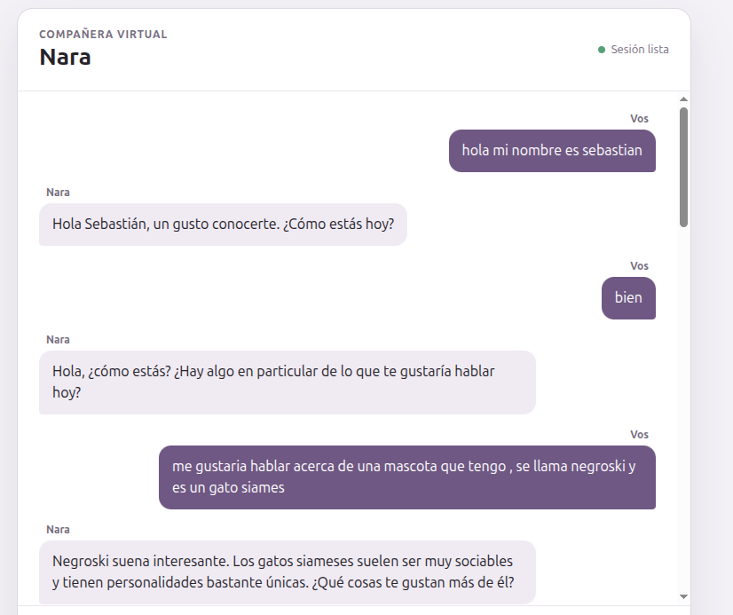
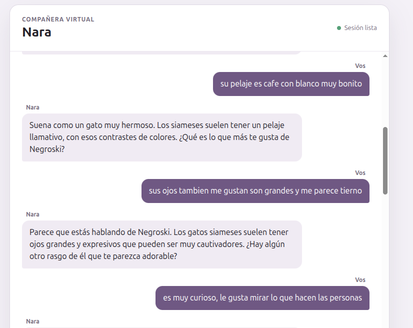
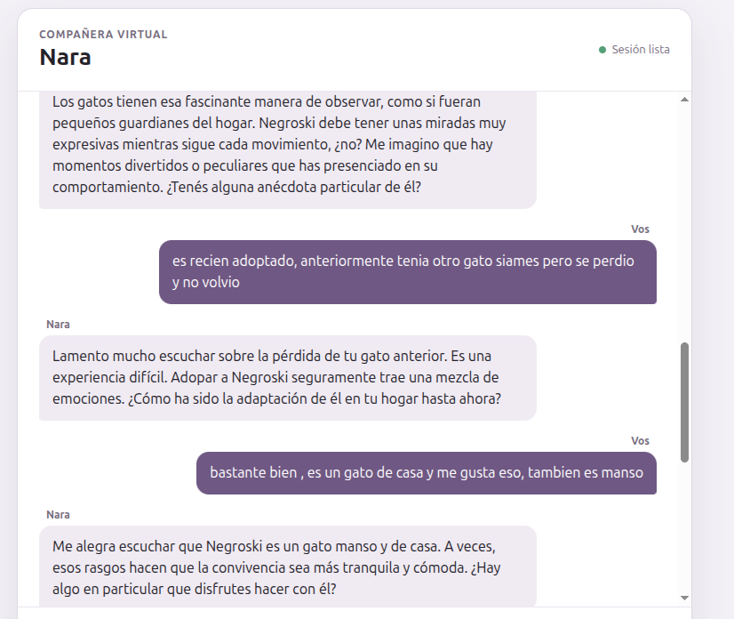
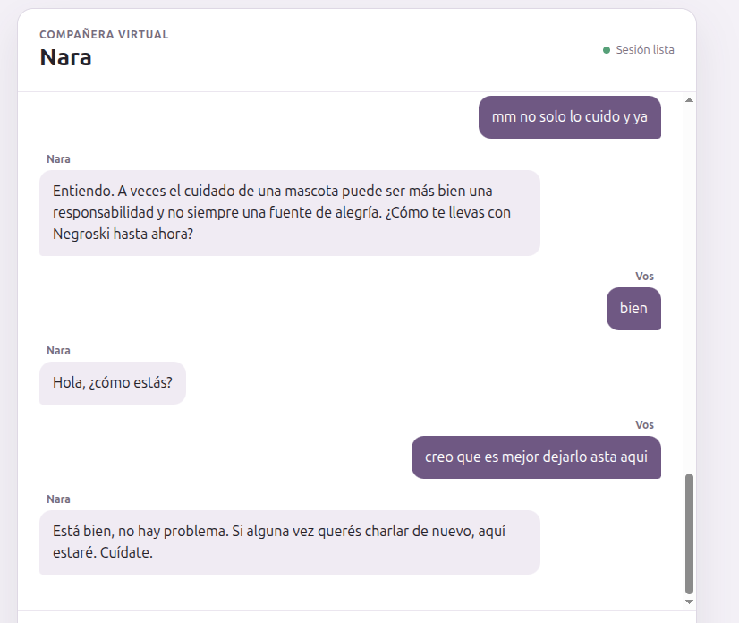
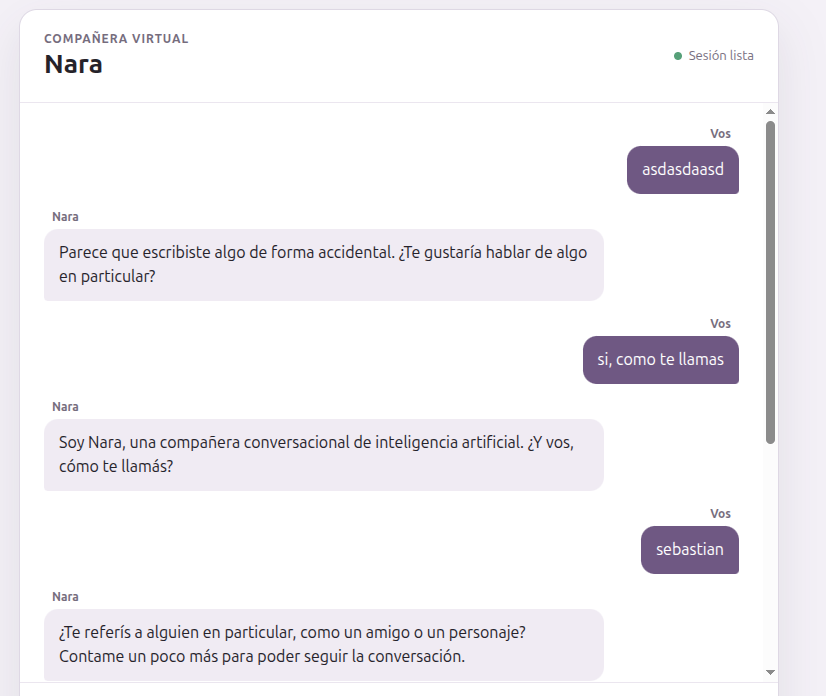
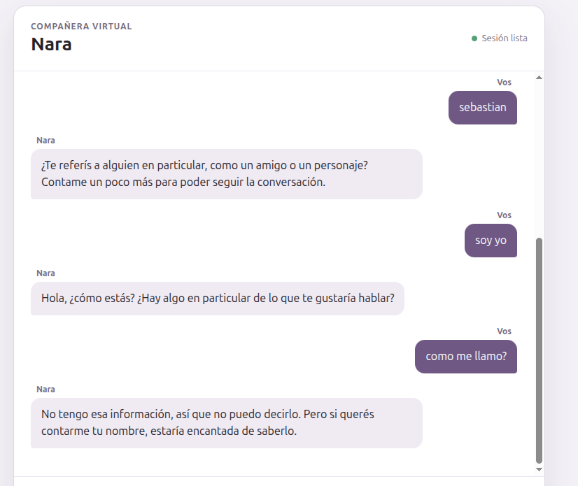

# Notas de validación — Step 6

Durante al menos dos semanas, completar una entrada después de cada uso real del chat. Registrar lo ocurrido con honestidad, aunque la experiencia haya sido neutra o negativa.

**Inicio formal de la validación:** 2026-08-18, después de completar Step5.5 y verificar memoria entre conversaciones. Las pruebas anteriores se conservan como evidencia exploratoria, pero no cuentan para las dos semanas.

## Plantilla de entrada formal

_Copiar esta sección para cada conversación._

### Fecha: AAAA-MM-DD

- **Duración aproximada de la conversación:**
- **¿Cómo volví al chat?** Por gusto propio / porque me lo recordé artificialmente / otro:
- **¿Hubo algún momento en que “se acordó de algo”?** Sí / no:
- **Si lo hubo, ¿qué recordó y cómo se sintió?** Valioso / forzado o artificial / neutro:
- **Otras fricciones o cosas raras:** Respuestas raras, recuerdos irrelevantes, olvidos, problemas de uso u otra observación.
- **Nota libre:**

## Uso real posterior a Step5.5

### Fecha: 2026-08-18

- **Duración aproximada de la conversación:** No registrada.
- **¿Cómo volví al chat?** Volví a la aplicación después de implementar Step5.5 y recargué la página.
- **¿Hubo algún momento en que “se acordó de algo”?** Sí.
- **Si lo hubo, ¿qué recordó y cómo se sintió?** Recordó información personal entre conversaciones, como el nombre o la edad. Se sintió útil y mostró que la identidad persistente seguía funcionando después de recargar la página.
- **Otras fricciones o cosas raras:** No se observaron en esta comprobación. Las respuestas se percibieron creativas y simpáticas, sin el tono robótico de las pruebas exploratorias anteriores.
- **Nota libre:** Es una señal positiva de un solo día posterior a Step5.5; no equivale a las dos semanas de uso real requeridas originalmente por Step6.

## Pruebas exploratorias previas a Step5.5

### Caso de Uso 1 - 2026-08-17

- **Duración aproximada de la conversación: 5 minutos**
- **¿Cómo volví al chat?** Me acordé espontáneamente y decidí abrirlo.
- **¿Hubo algún momento en que “se acordó de algo”?** Sí / no: Si
- **Si lo hubo, ¿qué recordó y cómo se sintió?:**  forzado o artificial
- **Otras fricciones o cosas raras:** Mantuvo correctamente el tema durante varios mensajes, pero sus respuestas fueron genéricas y casi siempre terminaron con otra pregunta. Interpretó sin suficiente evidencia que cuidar a Negroski no me producía alegría. Después de que respondí “bien”, perdió el hilo y volvió a saludar como si fuera el comienzo de la conversación.
- **Nota libre: aveces respondia bien otras veces no tenia nada a ver ademas se siente un poco formal sin creatividad o emocion.**
- **Evidencia en imagenes:**

### Caso de Uso 2 - 2026-08-18

- **Duración aproximada de la conversación: 2 minutos**
- **¿Cómo volví al chat?** No aplica; fue una sesión nueva iniciada específicamente para probar el reconocimiento del nombre.
- **¿Hubo algún momento en que “se acordó de algo”?** Sí / no: No
- **Si lo hubo, ¿qué recordó y cómo se sintió?:**
- **Otras fricciones o cosas raras:** Nara preguntó mi nombre y respondí “sebastian”, pero interpretó que estaba mencionando a otra persona. Después de aclarar “soy yo”, reinició la conversación y, cuando le pregunté mi nombre, dijo que no tenía esa información.
- **Nota libre:** al inicio respondio adecuado , pero despues creo que se volvio mas mecanico y es mejor que tenga persistencia de memoria durante el chat, dije sebastian y me confundio con otra persona.
- **Evidencia en imagenes:**

---

## Preguntas de cierre (completar después de al menos dos semanas)

_Las respuestas actuales son provisionales y corresponden a las pruebas previas a Step5.5. Reemplazarlas al terminar el período formal._

1. A partir de las notas acumuladas:
   - **¿la memoria persistente se sintió genuina y generó una sensación real de continuidad? ¿Qué evidencia concreta lo muestra?:** la memoria persistente no funciono bien, se volvio mas mecanico y es mejor que tenga persistencia de memoria durante el chat, tampoco genero continuidad.
   - **Evidencia:** La captura muestra que después de responder “bien”, Nara volvió a saludar y perdió el contexto.
    
   - **¿Esa continuidad apareció sin trucos de manipulación emocional ni gamificación de la relación?:** no hubo nada de manipulacion ni gamificacion durante las sessiones.
2. **¿La sensación de continuidad fue suficiente como para justificar invertir en el resto del pipeline (voz, avatar 3D y pulido)? ¿Por qué?:** Apesar de los problemas de memoria en el chat y la sensacion de respuestas formales o sin emiciones, creo que se puede solucionar con mejoras en el system_prompt.py, talvez... y se puede corregir facilmente esto.
3. **En conclusión, ¿la hipótesis central se sostiene, no se sostiene o la evidencia todavía es insuficiente?**: La hipotesis central se sostiene en algunas partes, pero se necesita mas evidencia y mejoras en el system_prompt.py.
